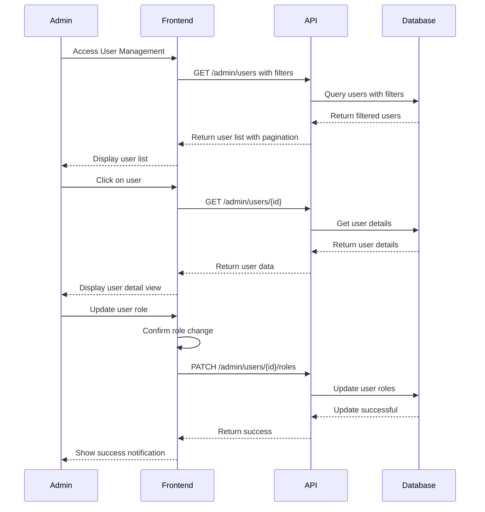
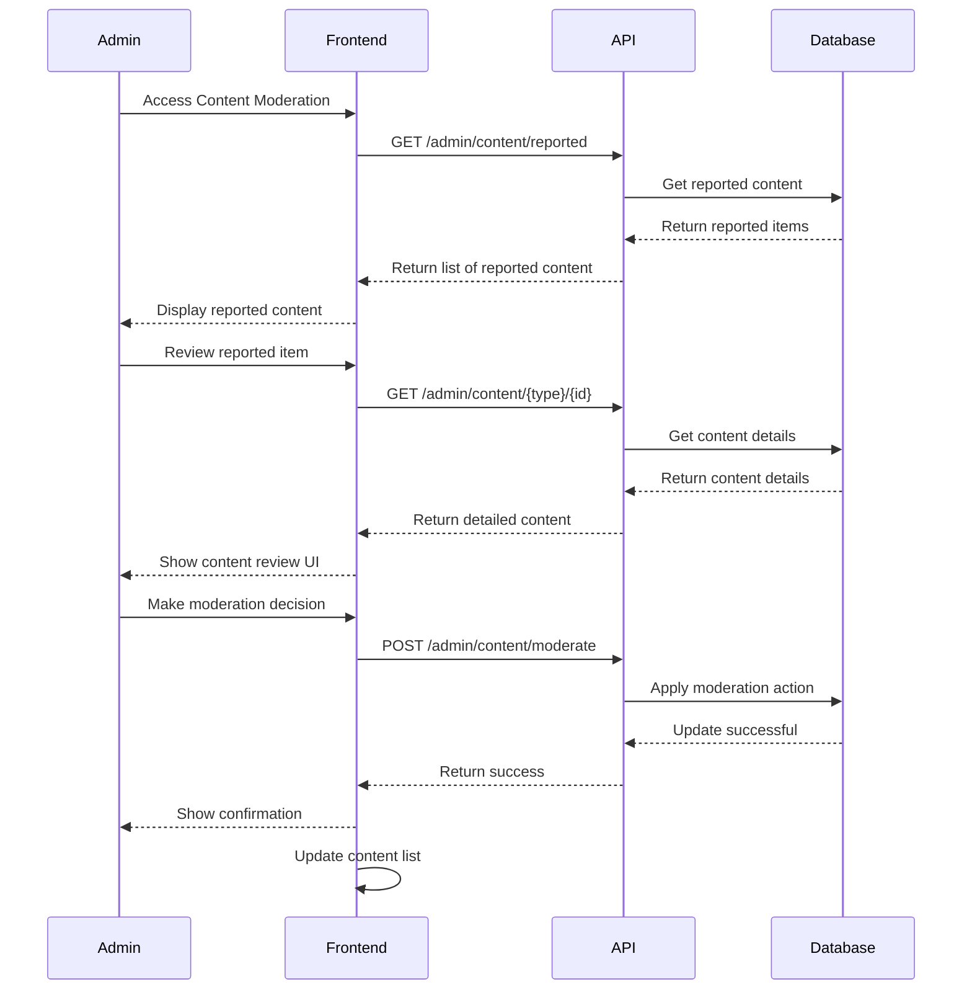
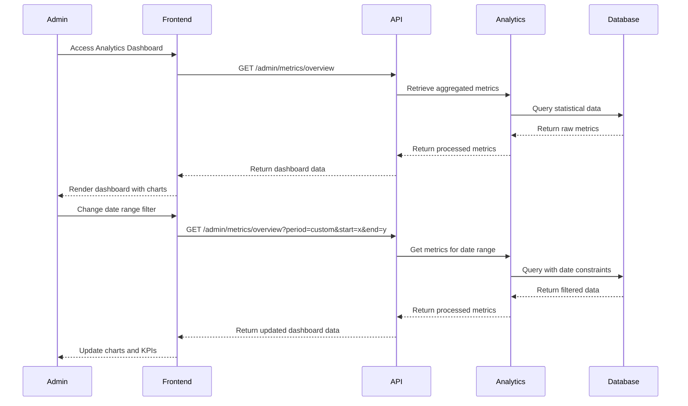
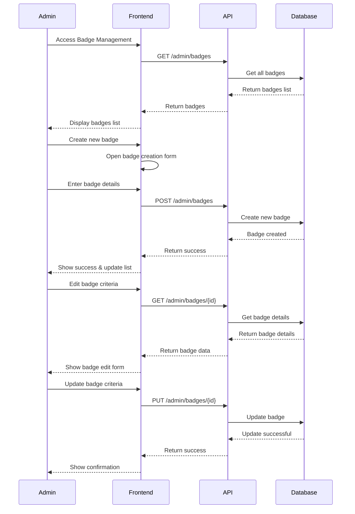
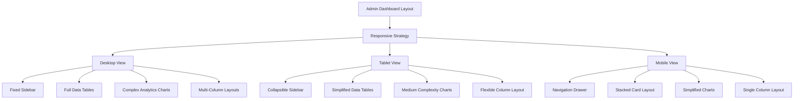
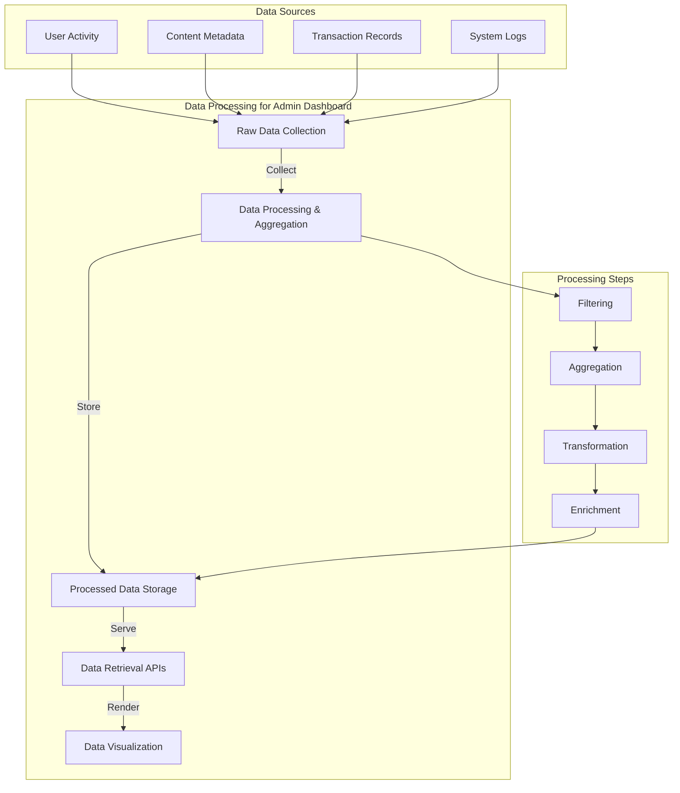

# Admin Dashboard Functionality Diagram

This document visualizes the structure and functionality of the Admin Dashboard in the Ngoma platform.

## Dashboard Overview

```mermaid
flowchart TD
    AdminDashboard[Admin Dashboard] --> Overview[Dashboard Overview]
    AdminDashboard --> UserManagement[User Management]
    AdminDashboard --> ContentMgmt[Content Management]
    AdminDashboard --> ReportingAnalytics[Reporting & Analytics]
    AdminDashboard --> SystemSettings[System Settings]
    AdminDashboard --> BadgeManagement[Badge Management]

    %% Overview section
    Overview --> KPICards[Key Performance Indicators]
    Overview --> ActivityFeeds[Recent Activity]
    Overview --> AlertsNotifications[Alerts & Notifications]
    Overview --> QuickStats[Platform Statistics]

    %% User Management section
    UserManagement --> UserList[User Listing & Search]
    UserManagement --> UserDetails[User Profile Details]
    UserManagement --> UserRoles[Role Assignment]
    UserManagement --> UserVerification[Account Verification]
    UserManagement --> UserBanning[Account Restriction]

    %% Content Management section
    ContentMgmt --> TracksMgmt[Tracks Management]
    ContentMgmt --> AlbumsMgmt[Albums Management]
    ContentMgmt --> EventsMgmt[Events Management]
    ContentMgmt --> MerchMgmt[Merchandise Management]
    ContentMgmt --> ContentModeration[Content Moderation]
    ContentMgmt --> ReportedContent[Reported Content]

    %% Reporting & Analytics section
    ReportingAnalytics --> UserMetrics[User Growth & Engagement]
    ReportingAnalytics --> ContentMetrics[Content Performance]
    ReportingAnalytics --> RevenueReports[Revenue Reports]
    ReportingAnalytics --> NFTAnalytics[NFT Transaction Analytics]
    ReportingAnalytics --> ExportData[Export Reports]

    %% System Settings section
    SystemSettings --> PlatformConfig[Platform Configuration]
    SystemSettings --> EmailTemplates[Email Templates]
    SystemSettings --> IntegrationSettings[Third-Party Integrations]
    SystemSettings --> SecuritySettings[Security Settings]

    %% Badge Management section
    BadgeManagement --> BadgesList[Badges List]
    BadgeManagement --> BadgeCreation[Create New Badge]
    BadgeManagement --> BadgeAssignment[Assign Badges to Users]
    BadgeManagement --> BadgeCriteria[Define Badge Criteria]
```

## Component Architecture

```mermaid
flowchart TD
    subgraph "Admin Dashboard Components"
        AdminDashboardLayout[AdminDashboardLayout]
        AdminSidebar[AdminSidebar]
        AdminHeader[AdminHeader]

        %% Content components
        OverviewComponent[OverviewComponent]
        UserManagementComponent[UserManagementComponent]
        ContentManagementComponent[ContentManagementComponent]
        ReportingComponent[ReportingComponent]
        SettingsComponent[SettingsComponent]
        BadgeManagementComponent[BadgeManagementComponent]

        %% Shared components
        DataTable[DataTable]
        SearchFilters[SearchFilters]
        ChartComponent[ChartComponent]
        MetricsCard[MetricsCard]
        ActionButtons[ActionButtons]
        ConfirmDialog[ConfirmDialog]
        Pagination[Pagination]

        %% Form components
        UserForm[UserForm]
        BadgeForm[BadgeForm]
        SettingsForm[SettingsForm]
    end

    AdminDashboardLayout --> AdminSidebar
    AdminDashboardLayout --> AdminHeader
    AdminDashboardLayout --> ContentContainers

    subgraph ContentContainers
        OverviewComponent
        UserManagementComponent
        ContentManagementComponent
        ReportingComponent
        SettingsComponent
        BadgeManagementComponent
    end

    UserManagementComponent --> DataTable
    UserManagementComponent --> SearchFilters
    UserManagementComponent --> UserForm
    UserManagementComponent --> ActionButtons
    UserManagementComponent --> Pagination

    ContentManagementComponent --> DataTable
    ContentManagementComponent --> SearchFilters
    ContentManagementComponent --> ActionButtons
    ContentManagementComponent --> Pagination

    OverviewComponent --> MetricsCard
    OverviewComponent --> ChartComponent

    ReportingComponent --> ChartComponent
    ReportingComponent --> DataTable
    ReportingComponent --> SearchFilters

    BadgeManagementComponent --> DataTable
    BadgeManagementComponent --> BadgeForm
    BadgeManagementComponent --> ActionButtons

    %% Common interaction patterns
    DataTable --> ConfirmDialog
    ActionButtons --> ConfirmDialog
```

## User Management Flow

## Content Moderation Flow

## Analytics Dashboard Flow

## Badge Management Flow

## Responsive Design Strategy

## Data Processing Workflow

This comprehensive diagram illustrates the structure and workflows of the Admin Dashboard, highlighting the component architecture, key user flows, and data processing mechanisms required for administrative functions on the Ngoma platform.
