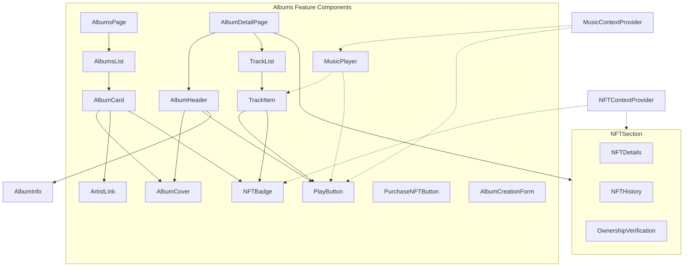
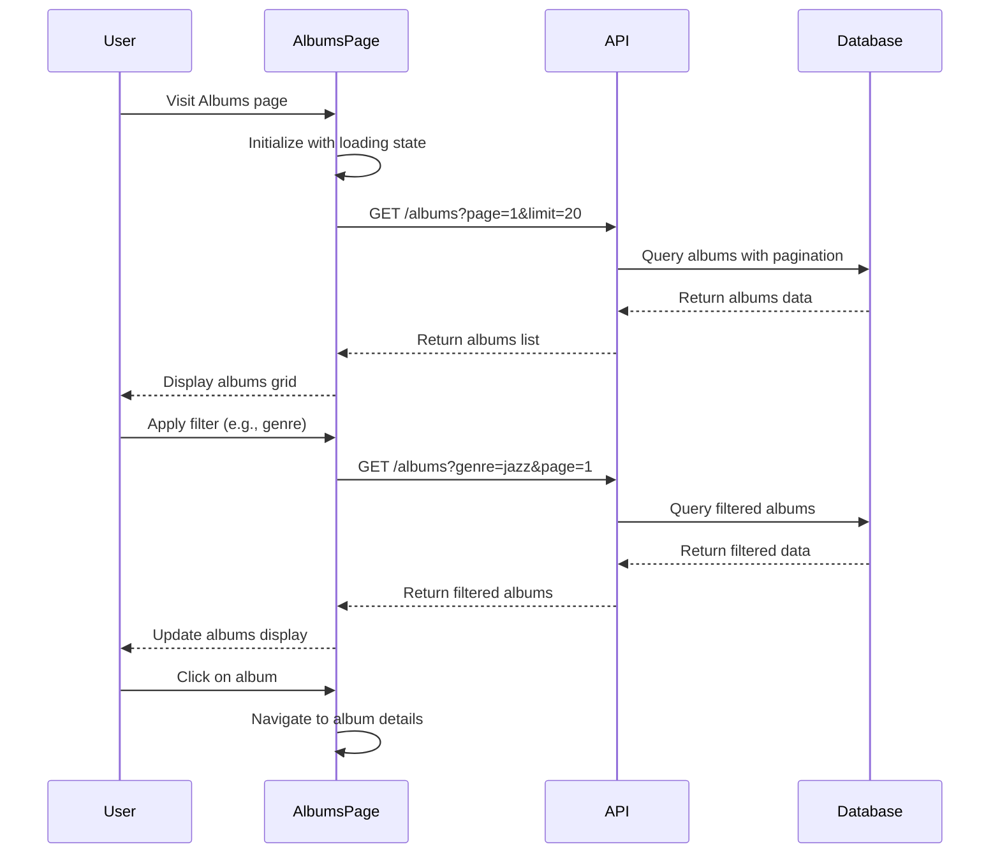
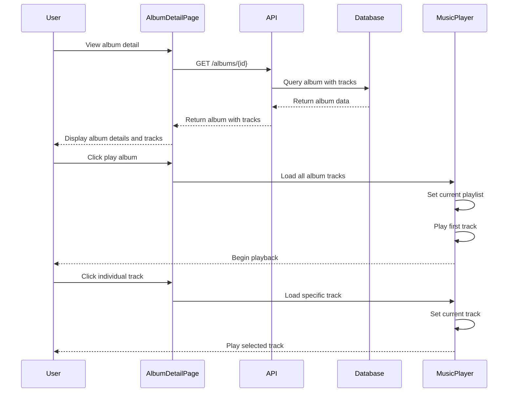
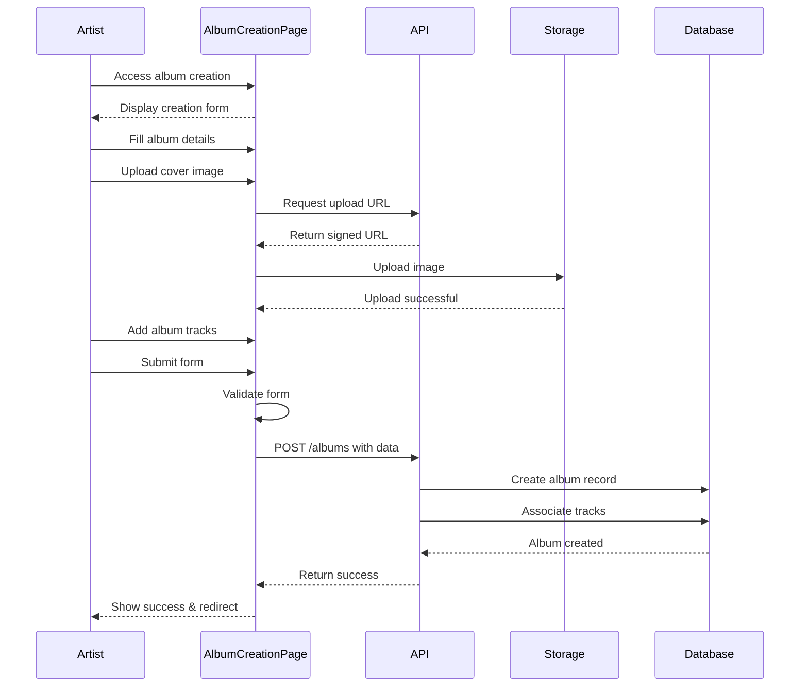
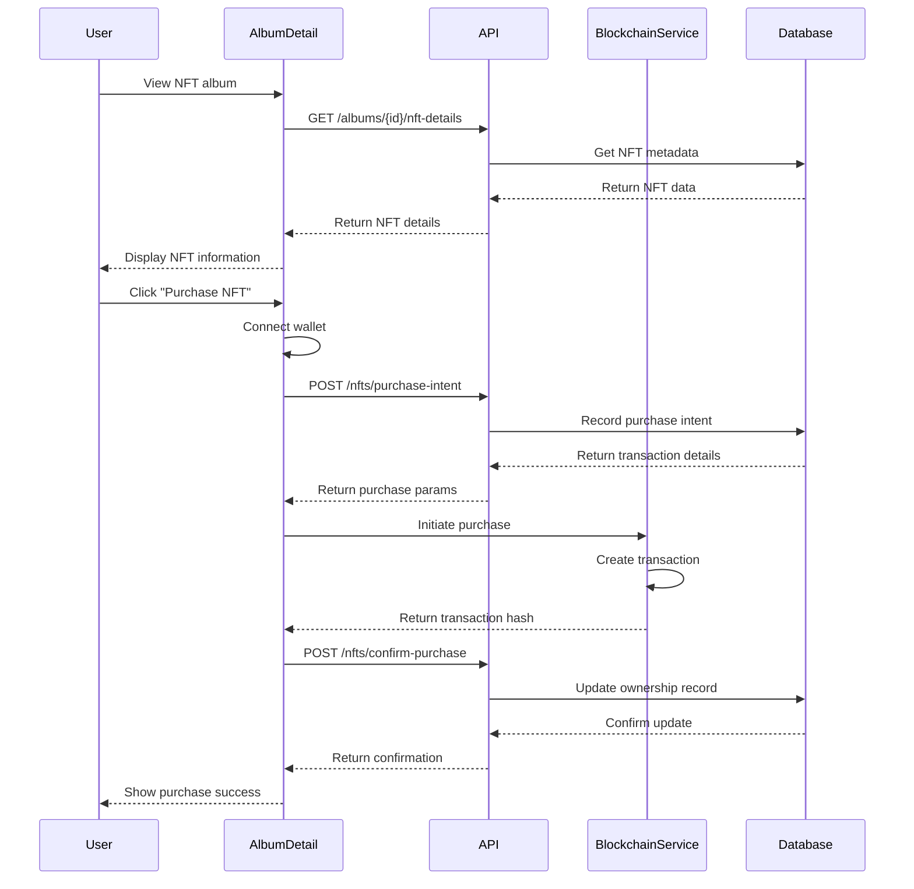
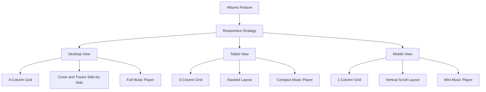
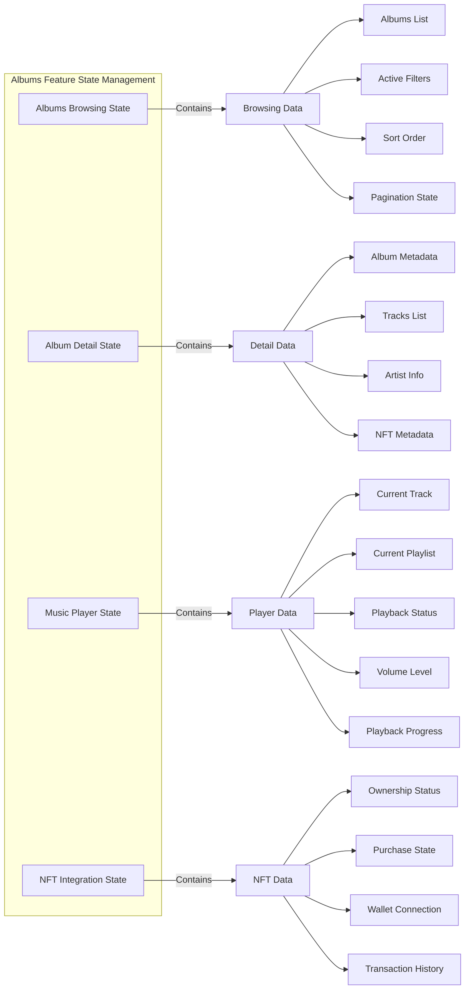

# Albums Feature Functionality Diagram

This document provides a comprehensive visualization of the album feature structure, user flows, and component interactions in the Ngoma platform.

## Core Feature Structure

```mermaid
graph LR
    subgraph Albums Feature
        AlbumsBrowser[Albums Browser]
        AlbumDetail[Album Detail View]
        TrackList[Album Track List]
        MusicPlayer[Music Player]
        NFTIntegration[NFT Integration]
        AlbumCover[Album Cover Display]
        AlbumCreation[Album Creation]
        User --> AlbumsBrowser
        AlbumsBrowser --> AlbumDetail
        AlbumDetail --> TrackList
        TrackList --> MusicPlayer
        AlbumDetail --> NFTIntegration
        AlbumDetail --> AlbumCover
        ArtistUser[Artist User] --> AlbumCreation
        AlbumCreation --> AlbumDB[(Album Database)]
        note right of AlbumDetail: Handles NFT purchase\nand ownership check
        note left of MusicPlayer: Handles track preview\nand full playback
        note right of AlbumCreation: Implement input\nvalidation & auth
    end
```

## Component Architecture



## User Flows

### Album Browsing Flow



### Album Detail View Flow



### Album Creation Flow (Artists)



### NFT Features Flow



## Mobile Responsiveness



## State Management



By implementing the album features according to this diagram, the Ngoma platform will provide a seamless user experience for browsing, playing, and interacting with music albums, including specialized NFT functionality for digital ownership.
