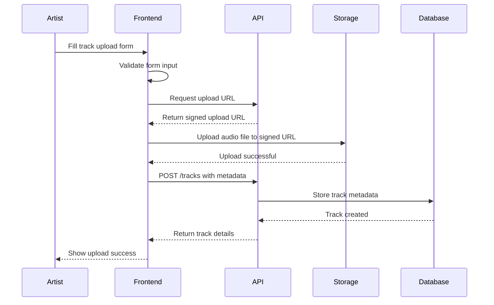
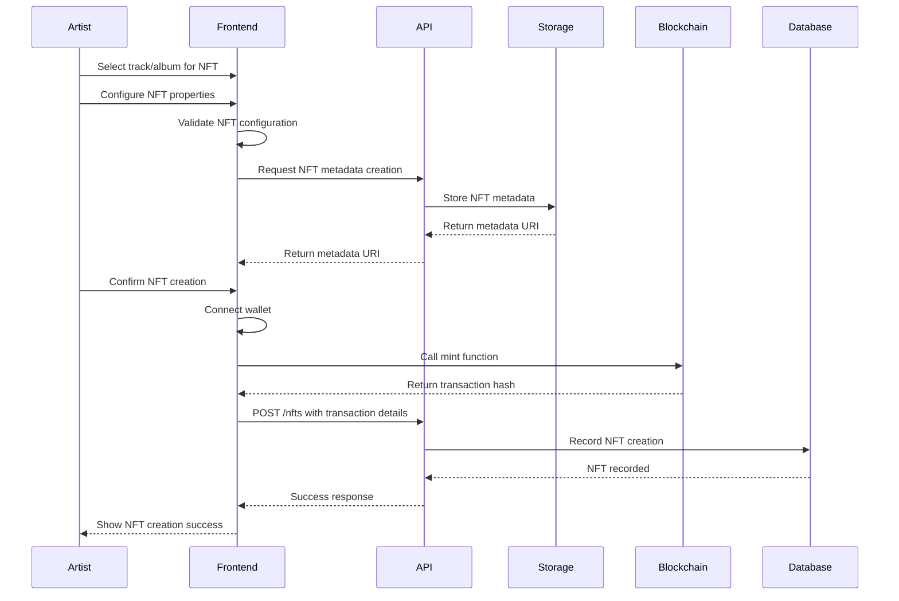
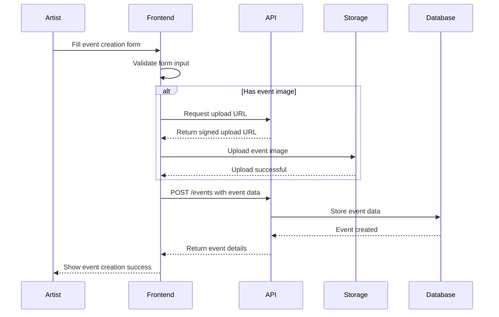
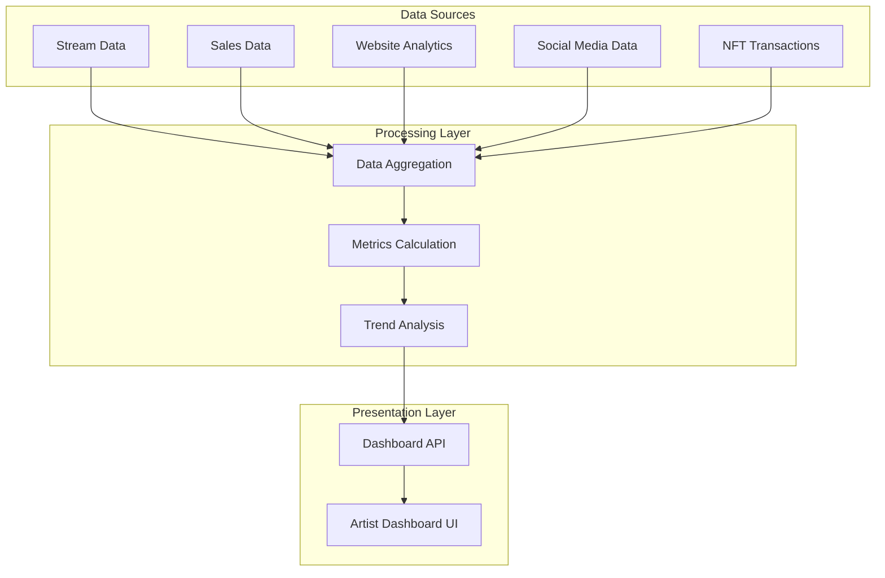
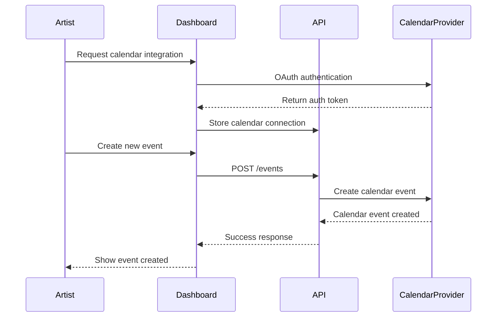
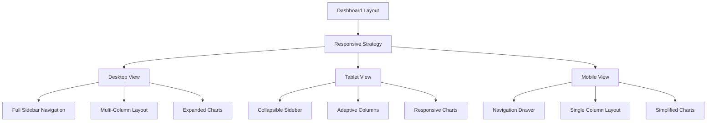

# Artist Dashboard Functionality Diagram

This document visualizes the structure and functionality of the Artist Dashboard in the Ngoma platform.

## Dashboard Overview

```mermaid
flowchart TD
    ArtistDashboard[Artist Dashboard] --> Overview[Overview/Analytics]
    ArtistDashboard --> TrackMgmt[Track Management]
    ArtistDashboard --> AlbumMgmt[Album Management]
    ArtistDashboard --> EventMgmt[Event Management]
    ArtistDashboard --> MerchMgmt[Merchandise Management]
    ArtistDashboard --> NFTMgmt[NFT Management]
    ArtistDashboard --> ProfileMgmt[Profile Management]

    %% Overview/Analytics section
    Overview --> ListenerStats[Listener Statistics]
    Overview --> RevenueMetrics[Revenue Metrics]
    Overview --> EngagementData[Fan Engagement Data]
    Overview --> PerformanceTracker[Content Performance]

    %% Track Management section
    TrackMgmt --> UploadTrack[Upload New Track]
    TrackMgmt --> ManageTracks[Manage Existing Tracks]
    TrackMgmt --> TrackAnalytics[Track Performance]

    %% Album Management section
    AlbumMgmt --> CreateAlbum[Create New Album]
    AlbumMgmt --> ManageAlbums[Manage Existing Albums]
    AlbumMgmt --> AlbumAnalytics[Album Performance]

    %% Event Management section
    EventMgmt --> CreateEvent[Create New Event]
    EventMgmt --> ManageEvents[Manage Existing Events]
    EventMgmt --> EventAnalytics[Event Performance]

    %% Merchandise Management section
    MerchMgmt --> CreateMerch[Create New Merchandise]
    MerchMgmt --> ManageMerch[Manage Existing Merchandise]
    MerchMgmt --> MerchAnalytics[Merchandise Sales]

    %% NFT Management section
    NFTMgmt --> CreateNFT[Create New NFT]
    NFTMgmt --> ManageNFTs[Manage Existing NFTs]
    NFTMgmt --> NFTAnalytics[NFT Sales & Royalties]
    NFTMgmt --> WalletConnection[Wallet Management]

    %% Profile Management section
    ProfileMgmt --> EditProfile[Edit Artist Profile]
    ProfileMgmt --> BrandingSettings[Branding Settings]
    ProfileMgmt --> SocialLinks[Social Media Links]
```

## Component Architecture

```mermaid
flowchart TD
    subgraph "Artist Dashboard Components"
        ArtistDashboardLayout[ArtistDashboardLayout]
        ArtistSidebar[ArtistSidebar]
        ArtistHeader[ArtistHeader]

        %% Content components
        OverviewComponent[OverviewComponent]
        TrackManagement[TrackManagement]
        AlbumManagement[AlbumManagement]
        EventManagement[EventManagement]
        MerchandiseManagement[MerchandiseManagement]
        NFTManagement[NFTManagement]
        ProfileManagement[ProfileManagement]

        %% Shared components
        UploadForm[UploadForm]
        MetricsDisplay[MetricsDisplay]
        DataTable[DataTable]
        ChartComponent[ChartComponent]

        %% Web3 components
        WalletConnector[WalletConnector]
        NFTMinter[NFTMinter]
        ContractInteraction[ContractInteraction]
    end

    ArtistDashboardLayout --> ArtistSidebar
    ArtistDashboardLayout --> ArtistHeader
    ArtistDashboardLayout --> ContentComponents

    subgraph ContentComponents
        OverviewComponent
        TrackManagement
        AlbumManagement
        EventManagement
        MerchandiseManagement
        NFTManagement
        ProfileManagement
    end

    TrackManagement --> UploadForm
    TrackManagement --> DataTable
    TrackManagement --> MetricsDisplay

    AlbumManagement --> UploadForm
    AlbumManagement --> DataTable
    AlbumManagement --> MetricsDisplay

    EventManagement --> UploadForm
    EventManagement --> DataTable
    EventManagement --> MetricsDisplay

    MerchandiseManagement --> UploadForm
    MerchandiseManagement --> DataTable
    MerchandiseManagement --> MetricsDisplay

    NFTManagement --> WalletConnector
    NFTManagement --> NFTMinter
    NFTManagement --> ContractInteraction
    NFTManagement --> DataTable
    NFTManagement --> MetricsDisplay

    OverviewComponent --> ChartComponent
    OverviewComponent --> MetricsDisplay
```

## Track Upload Flow

## NFT Creation Flow

## Event Management Flow

## Analytics Data Flow

## Calendar Integration

## Responsive Layout Strategy

This comprehensive diagram illustrates the structure and workflows of the Artist Dashboard, highlighting the component architecture, key user flows, and responsive design strategy for a seamless artist experience on the Ngoma platform.
