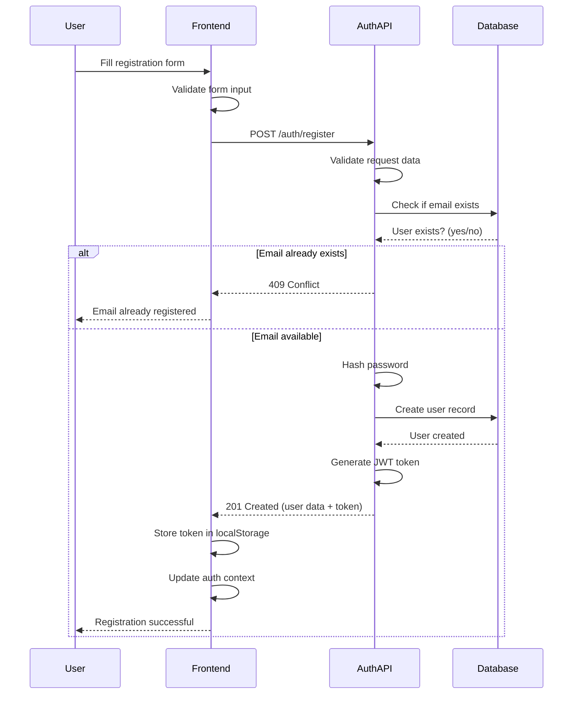
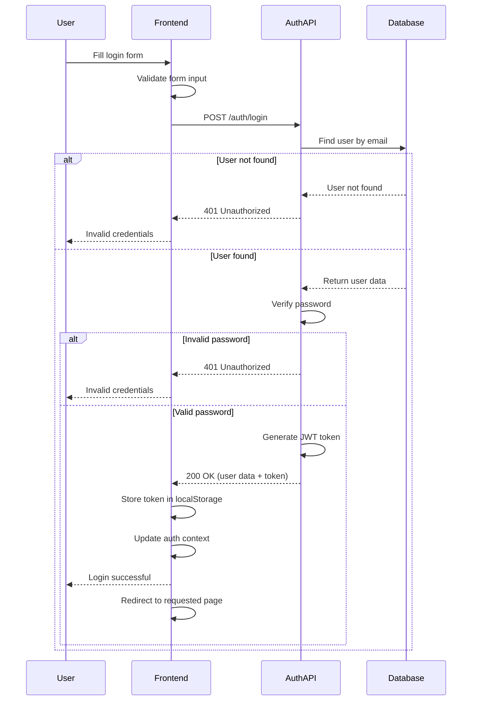
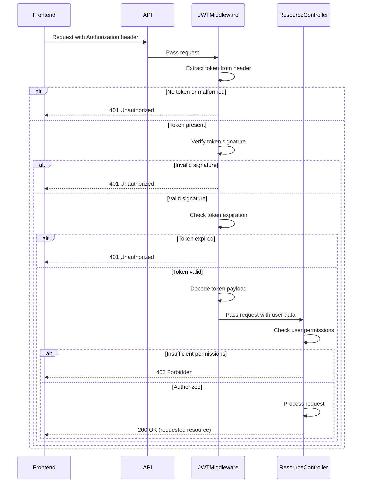
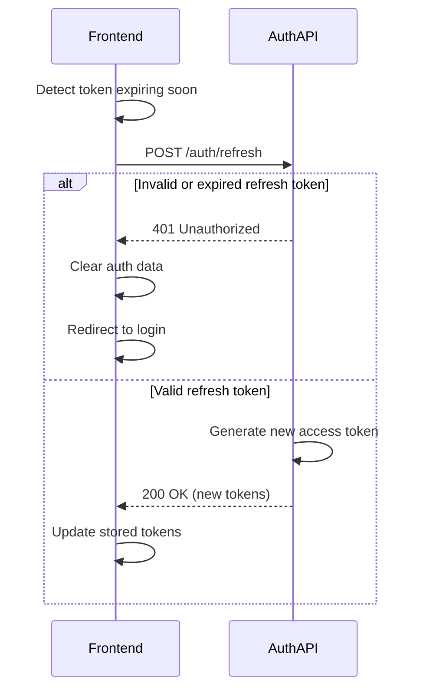
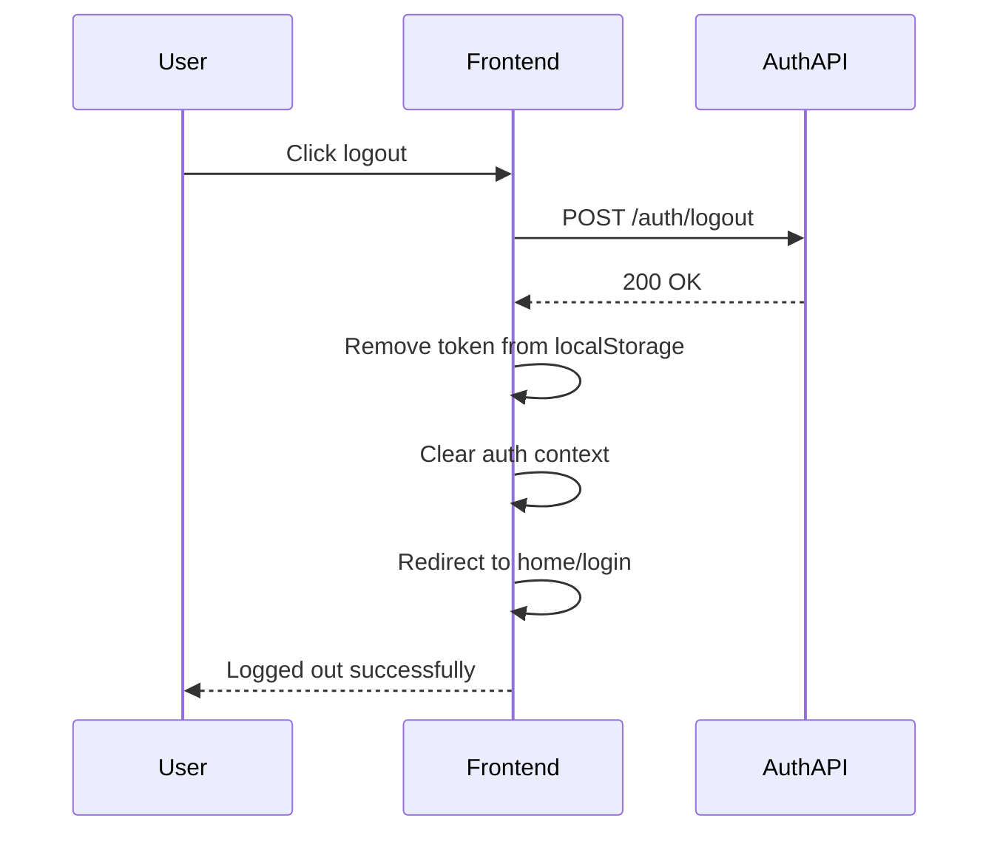
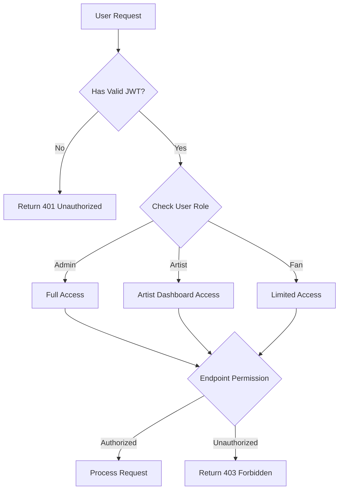

# Authentication Flow Diagram

This document visualizes the authentication flow for the Ngoma platform, covering user registration, login, token management, and protected resource access.

## Registration Flow

## Login Flow

## Token Verification & Protected Resource Access

## Token Refresh Flow

## Logout Flow

## Role-Based Access Control

## Security Considerations

### Token Management

- Access tokens are short-lived (expires in 15-60 minutes)
- Tokens are stored in memory or secure storage, not in cookies
- HTTPS is enforced for all API requests

### Password Security

- Passwords are hashed using bcrypt with appropriate salt rounds
- Password strength requirements are enforced on registration
- Rate limiting is applied to authentication endpoints

### Session Management

- JWT is stateless, but server can still invalidate tokens if needed
- User sessions can be terminated from admin panel
- Session activity is logged for security monitoring

This authentication system combines modern JWT-based authentication with role-based access control to provide secure, scalable user authentication for the Ngoma platform.
