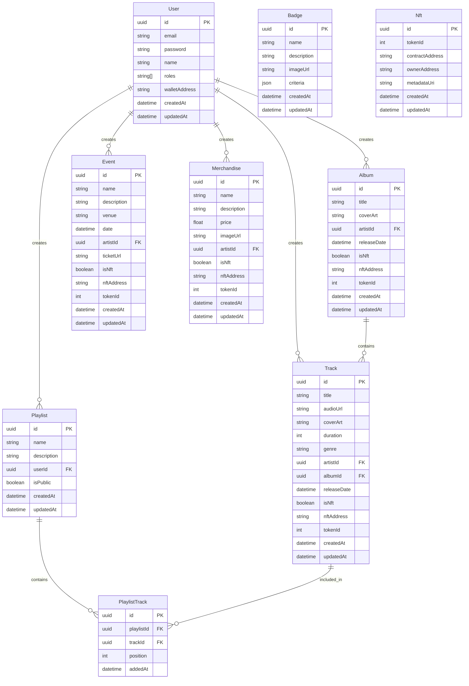

# Ngoma Database Schema

This document provides a visual representation and explanation of the Ngoma platform's database structure.

## Entity Relationship Diagram

## Schema Description

### User Entity

The `User` entity represents all users in the system, including fans, artists, and administrators.

- **id**: Primary key, UUID
- **email**: Unique email address for login and communication
- **password**: Hashed password for authentication
- **name**: User's display name
- **roles**: Array of roles assigned to the user (e.g., 'admin', 'artist', 'fan')
- **walletAddress**: Optional blockchain wallet address for NFT transactions
- **createdAt**: Timestamp when the user account was created
- **updatedAt**: Timestamp when the user account was last updated

### Track Entity

Represents a music track in the platform.

- **id**: Primary key, UUID
- **title**: Title of the track
- **audioUrl**: URL to the audio file
- **coverArt**: Optional URL to track cover art
- **duration**: Length of the track in seconds
- **genre**: Optional music genre classification
- **artistId**: Foreign key to User (with artist role)
- **albumId**: Optional foreign key to Album
- **releaseDate**: When the track was or will be released
- **isNft**: Boolean indicating if the track is tokenized as an NFT
- **nftAddress**: Optional contract address for NFT
- **tokenId**: Optional token ID for NFT
- **createdAt**: Timestamp when the track was created in the system
- **updatedAt**: Timestamp when the track was last updated

### Album Entity

Represents a collection of tracks.

- **id**: Primary key, UUID
- **title**: Album title
- **coverArt**: Optional URL to album cover art
- **artistId**: Foreign key to User (with artist role)
- **releaseDate**: When the album was or will be released
- **isNft**: Boolean indicating if the album is tokenized as an NFT
- **nftAddress**: Optional contract address for NFT
- **tokenId**: Optional token ID for NFT
- **createdAt**: Timestamp when the album was created in the system
- **updatedAt**: Timestamp when the album was last updated

### Event Entity

Represents artist events such as concerts or live streams.

- **id**: Primary key, UUID
- **name**: Event name
- **description**: Optional detailed description
- **venue**: Location or platform for the event
- **date**: When the event will take place
- **artistId**: Foreign key to User (with artist role)
- **ticketUrl**: Optional URL for ticket purchases
- **isNft**: Boolean indicating if the event tickets are tokenized as NFTs
- **nftAddress**: Optional contract address for NFT
- **tokenId**: Optional token ID for NFT
- **createdAt**: Timestamp when the event was created in the system
- **updatedAt**: Timestamp when the event was last updated

### Merchandise Entity

Represents physical or digital merchandise sold by artists.

- **id**: Primary key, UUID
- **name**: Product name
- **description**: Optional detailed description
- **price**: Product price
- **imageUrl**: Optional URL to product image
- **artistId**: Foreign key to User (with artist role)
- **isNft**: Boolean indicating if the merchandise is tokenized as an NFT
- **nftAddress**: Optional contract address for NFT
- **tokenId**: Optional token ID for NFT
- **createdAt**: Timestamp when the merchandise was created in the system
- **updatedAt**: Timestamp when the merchandise was last updated

### Badge Entity

Represents achievements or accolades users can earn.

- **id**: Primary key, UUID
- **name**: Badge name
- **description**: Optional detailed description
- **imageUrl**: Optional URL to badge image
- **criteria**: JSON object defining requirements to earn the badge
- **createdAt**: Timestamp when the badge was created in the system
- **updatedAt**: Timestamp when the badge was last updated

### NFT Entity

Tracks NFT ownership and metadata across the platform.

- **id**: Primary key, UUID
- **tokenId**: NFT token ID on the blockchain
- **contractAddress**: Smart contract address
- **ownerAddress**: Wallet address of the current owner
- **metadataUri**: URI pointing to the NFT metadata
- **createdAt**: Timestamp when the NFT was created in the system
- **updatedAt**: Timestamp when the NFT was last updated

### Playlist Entity

Represents user-created collections of tracks.

- **id**: Primary key, UUID
- **name**: Playlist name
- **description**: Optional detailed description
- **userId**: Foreign key to User who created the playlist
- **isPublic**: Boolean indicating if the playlist is publicly accessible
- **createdAt**: Timestamp when the playlist was created
- **updatedAt**: Timestamp when the playlist was last updated

### PlaylistTrack Entity

Junction table managing the many-to-many relationship between playlists and tracks.

- **id**: Primary key, UUID
- **playlistId**: Foreign key to Playlist
- **trackId**: Foreign key to Track
- **position**: Order of the track within the playlist
- **addedAt**: Timestamp when the track was added to the playlist

## Key Relationships

1. **User to Content**: One-to-many relationships from User to Track, Album, Event, Merchandise, and Playlist. A user (particularly with the 'artist' role) can create multiple pieces of content.

2. **Album to Track**: One-to-many relationship from Album to Track. An album contains multiple tracks.

3. **Playlist to Track**: Many-to-many relationship between Playlist and Track, implemented through the PlaylistTrack junction table. A playlist can contain multiple tracks, and a track can be in multiple playlists.

## Database Constraints

- Email addresses must be unique across all users
- Wallet addresses must be unique across all users
- The combination of tokenId and contractAddress must be unique in the NFT table
- All foreign key relationships enforce referential integrity

## Indexing Strategy

For optimal query performance, indexes should be created on:

1. All foreign key fields (artistId, albumId, userId, playlistId, trackId)
2. Fields commonly used in filters (genre, releaseDate, date, isNft)
3. Full-text search indexes on text fields like title, name, and description
4. Fields used in sorting (releaseDate, addedAt, createdAt)

This schema design provides the foundation for the Ngoma platform's data storage needs, supporting all features outlined in the system requirements while maintaining flexibility for future enhancements.
